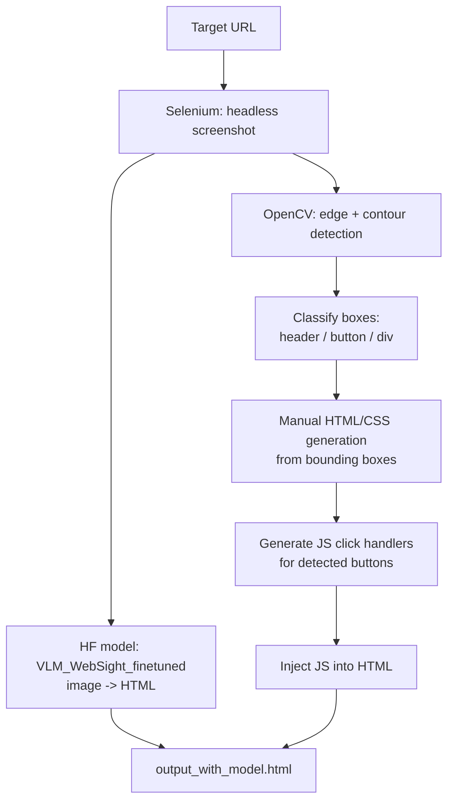

# HuggingFace-Model-Web-Automation

Screenshots a webpage, analyzes its visual layout with classic computer vision, and uses a Hugging Face vision-language model (`HuggingFaceM4/VLM_WebSight_finetuned`) to reconstruct it as HTML/CSS/JS. Two near-identical iterations of the same pipeline live side by side (`HuggigFace1/` and `HuggingFace/`).

## How it works

1. **Capture** — Selenium (headless Chrome) loads the target URL and saves a full-page screenshot.
2. **Detect layout** — OpenCV (`cv2.Canny` + contour detection) finds bounding boxes in the screenshot and heuristically labels each as a `header`, `button`, or generic `div` based on size.
3. **Generate with HF model** — the screenshot is fed to the locally-loaded `VLM_WebSight_finetuned` model (via `transformers`), which generates HTML directly from the image.
4. **Generate manually (fallback/comparison)** — the detected layout boxes are independently turned into absolutely-positioned HTML + CSS, and click handlers are generated for any detected buttons, then injected into the page as inline JS.
5. **Output** — both versions are written out for comparison (`output_with_model.html` from the HF model, plus the manually reconstructed page).



## Architecture

| Path | Role |
|---|---|
| `HuggigFace1/Main.py`, `HuggingFace/Main.py` | Full pipeline: screenshot → CV analysis → HF model + manual HTML/CSS/JS generation |
| `RepoCode.py` | Supporting/experimental script (HuggigFace1 only) |
| `versionss.py` | Dependency/version pinning notes |
| `requirement.txt` | Python dependencies per iteration |

## Tech stack

Python · Selenium + webdriver-manager · OpenCV · Hugging Face `transformers` · PyTorch

## Setup

```bash
cd HuggingFace   # or HuggigFace1
pip install -r requirement.txt
python Main.py
```
